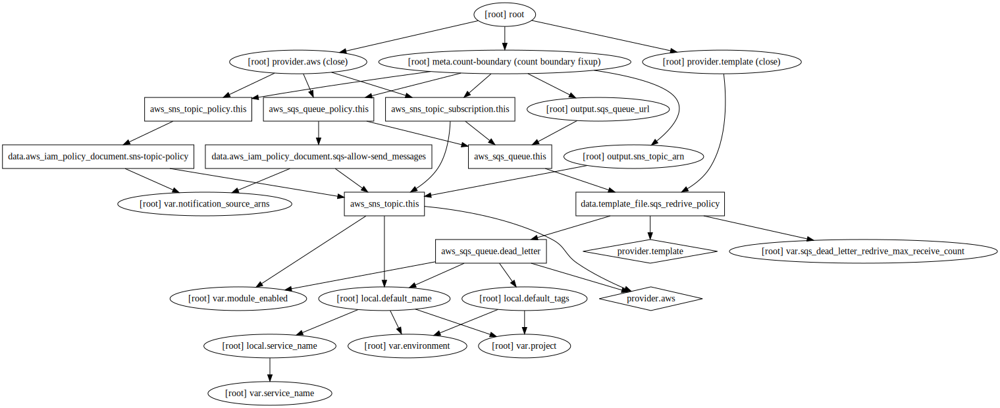

# Summary

Terraform module to setup SQS and SNS.

## Inputs

| Name | Description | Type | Default | Required |
|------|-------------|:----:|:-----:|:-----:|
| environment | Environment name will be used for naming resources in pattern %PROJECT_NAME%-%ENVIRONMENT_NAME% | string | `test` | no |
| module\_enabled | Trigger to enable/disable module | string | `true` | no |
| notification\_source\_arns | - | list | `<list>` | no |
| project | Project name will be used for naming resources in pattern %PROJECT_NAME%-%ENVIRONMENT_NAME% | string | `project` | no |
| service\_name | Service name will be used for naming resources in pattern %PROJECT_NAME%-%ENVIRONMENT_NAME%-%SERVICE_NAME% | string | `None` | no |
| sqs\_dead\_letter\_redrive\_max\_receive\_count | - | string | `5` | no |

## Outputs

| Name | Description |
|------|-------------|
| sns\_topic\_arn | SNS topic ARN |
| sqs\_queue\_url | SQS queue URL |

## Module graph

